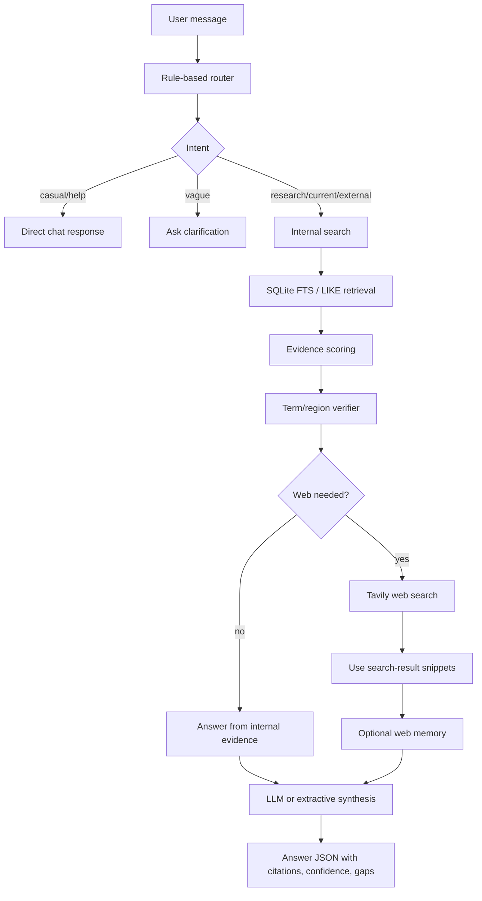
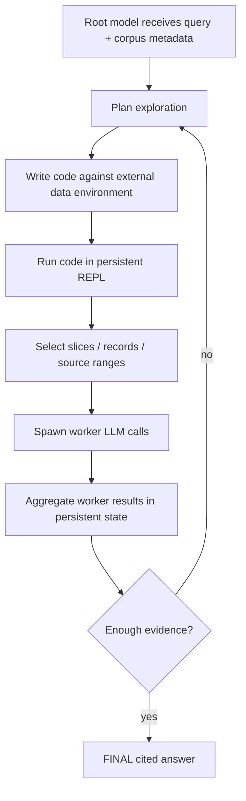
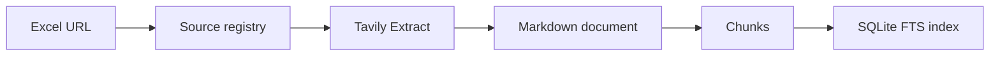
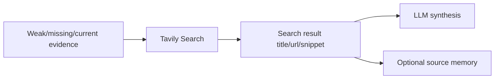
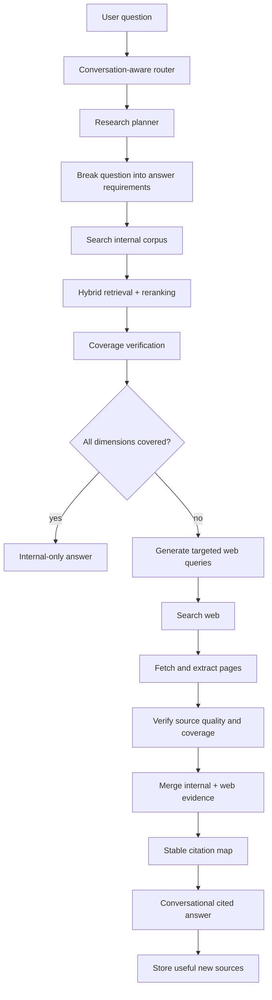
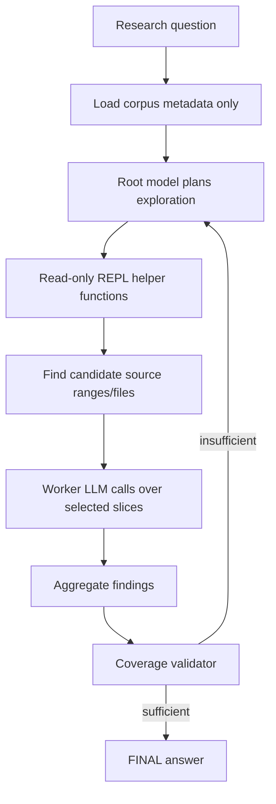

# Venture Metrics Architecture Taxonomy

> Last updated: 2026-06-03  
> Purpose: define the architecture terms used in this project so RAG, RLM, ReAct, and workflow-agent language do not get mixed up.

## Executive Summary

Venture Metrics currently has:

```text
Source-map RAG infrastructure
+ deterministic branching research controller
+ conditional web-search fallback
+ LLM answer synthesis
```

The current system is **not a full Recursive Language Model (RLM)** implementation yet.

The accurate label is:

```text
Internal-first RAG with an RLM-inspired deterministic research controller.
```

For meeting shorthand:

```text
Current: RAG + deterministic controller.
Direction: RLM-inspired research agent.
Future experiment: true RLM harness over the evidence library.
```

## Architecture Terms

| Term | Meaning | Status in Venture Metrics |
|---|---|---|
| RAG | Retrieval-Augmented Generation: retrieve evidence, give it to an LLM, generate an answer. | Implemented. This is the source library, chunks, SQLite FTS, citations, and answer synthesis. |
| Source-map RAG | RAG where spreadsheets are treated as source maps, not the knowledge base itself. The linked pages become evidence. | Implemented. Excel rows create the source registry, fetched documents, chunks, and FTS index. |
| CAG | Context-Augmented Generation: stuff curated context into the model window without a retrieval/indexing layer. | Not the main architecture. Used only in small prompt contexts such as chat history and selected evidence. |
| RLM | Recursive Language Model: an inference-time harness where the model treats data as an external environment, writes/executes code to inspect it, spawns worker model calls, aggregates results, and stops with a final answer. | Not fully implemented. Current system borrows the plan/act/observe/verify idea but lacks a REPL and recursive worker calls. |
| RLM-inspired controller | A bridge architecture that makes retrieval/search tools selected actions instead of automatic steps. | Implemented in `venture_metrics_agent/reasoning/`. |
| ReAct | LLM-driven Thought/Action/Observation loop where the model chooses tool calls step by step. | Not implemented as true ReAct. The Python controller chooses tools deterministically. |
| Deterministic branching workflow | Rule-based branches such as casual chat, internal search, web fallback, insufficient evidence. | Implemented. This is the current product brain. |
| Plan-execute-validate | Controller plans, executes tools, observes results, validates answerability, then iterates or answers. | Partially implemented. Current loop is bounded and deterministic. |

## What The Current System Actually Does



This is a **branching RAG workflow**. It is useful, but it is not enough for a Perplexity-like product because the web decision is based on weak sufficiency checks rather than complete answer coverage.

## What A True RLM Would Add

The Recursive Language Models article describes a stronger inference-time pattern:



Required pieces for true RLM:

| RLM piece | Current status |
|---|---|
| Persistent REPL/environment | Not implemented. Current state is Python controller state plus SQLite/filesystem persistence. |
| Model-written code to inspect data | Not implemented in the user-facing agent. Current code paths are predefined tools. |
| Recursive worker model calls | Not implemented. Current controller does bounded query refinement only. |
| Root/worker separation | Not implemented. There is one answer LLM call plus deterministic Python orchestration. |
| `FINAL(answer)` termination primitive | Not implemented literally. Current controller stops after fixed branches/iterations. |
| Max depth / max iterations / stdout limits | Partially present through `top_k`, `max_internal_iterations`, and `max_web_results`. |

So the correct statement is:

```text
We have not moved to full RLM yet.
We moved from pure RAG toward an RLM-inspired controller.
```

## Why The Current Confusion Happened

Earlier docs used the phrase **RLM-style reasoning controller**. That phrasing was too broad. It should be read as:

```text
RLM-inspired control flow, not academic/full RLM.
```

The implemented controller has the shape:

```text
route -> plan -> act -> observe -> verify -> answer
```

but it does not yet have:

```text
persistent REPL -> model-written exploration code -> recursive worker sub-calls -> FINAL()
```

## Current Data/Fetch Strategy

The system has two fetch paths.

### Ingestion Fetch



This is used to build the internal evidence library from Excel-linked pages.

### Query-Time Web Fallback



Important limitation:

```text
Query-time web fallback currently uses Tavily search snippets.
It does not yet fetch and extract the full web pages during the answer loop.
```

That is a major reason the product does not yet feel like Perplexity.

## Current vs Target

| Capability | Current | Target after fix |
|---|---|---|
| Source ingestion | Excel URLs -> registry -> fetched markdown -> chunks | Keep |
| Internal retrieval | SQLite FTS + LIKE fallback | Hybrid lexical + semantic retrieval, reranking |
| Agent control | Deterministic branches | Coverage-aware plan-execute-validate controller |
| Web fallback | Conditional Tavily snippets | Search -> fetch page -> extract text -> verify -> cite |
| RLM | Not full RLM | Separate experiment behind feature flag |
| Citations | Source cards from retrieved/web results | Stable citation map shared by prompt and UI |
| Answerability | Basic sufficiency scoring | Coverage verification across question dimensions |

## Recommended Meeting Language

Use this wording:

```text
The current prototype is not a full RLM. It is an internal-first RAG system with a deterministic, RLM-inspired research controller.

RAG is currently the evidence infrastructure: source ingestion, chunking, retrieval, and citations.

The controller is the product brain: it routes chat, decides whether to search internal sources, decides whether web fallback is needed, verifies evidence, and asks the LLM to synthesize the final answer.

The next architecture fix is to move from evidence sufficiency scoring to answer coverage verification. After that, we can test a true RLM harness where a root model programmatically explores the source library and delegates recursive worker calls.
```

## Target Architecture After The Current Fixes



## Architecture Lab Implementation

The repo now has a comparison harness under:

```text
venture_metrics_agent/architectures/
venture_metrics_agent/evaluation/
scripts/query_architecture.py
scripts/run_architecture_eval.py
```

Current runnable adapters:

| Adapter id | Architecture family | Notes |
|---|---|---|
| `linear_rag` | RAG | Legacy retrieve-score-answer baseline. |
| `deterministic_controller` | RLM-inspired workflow | Current product path. |
| `coverage_rag` | CRAG-inspired | Checks answer coverage before deciding whether web is needed. |
| `plan_execute` | Plan-and-execute | Decomposes questions into focused searches. |
| `react_loop` | ReAct-inspired | Bounded thought/action/observation-style tool loop; not true LLM-driven ReAct yet. |
| `cag_pack` | CAG-inspired | Source-pack comparison path; not true KV-cache CAG yet. |
| `rlm_experiment` | RLM-inspired | Worker-style read-only corpus inspection; not full RLM yet. |

All adapters return the same JSON contract so the UI and evaluation mode can compare outputs, citations, tool use, confidence, and latency.

## True RLM Experiment Scope

When we are ready to test true RLM, keep it separate from the live chat path:



Minimum implementation requirements:

| Requirement | Notes |
|---|---|
| Read-only environment | Prevent accidental corpus mutation. |
| Max iterations | Hard cap to control latency/cost. |
| Max workers | Prevent recursive explosion. |
| Max output chars | Keep root context clean. |
| Citation ledger | Every worker finding must carry source IDs/URLs. |
| Evaluation set | Compare against current RAG/controller path before replacing anything. |
