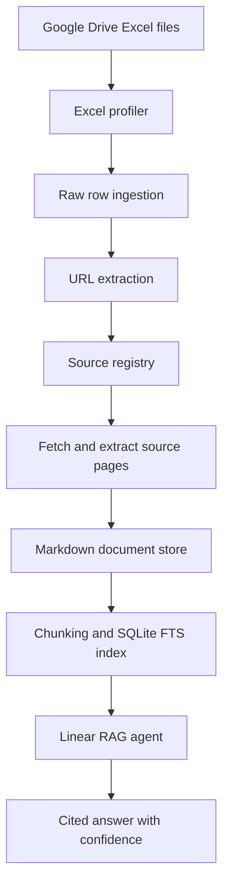
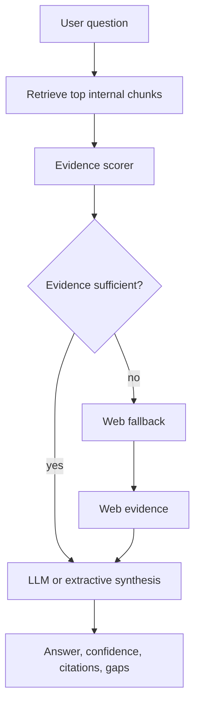
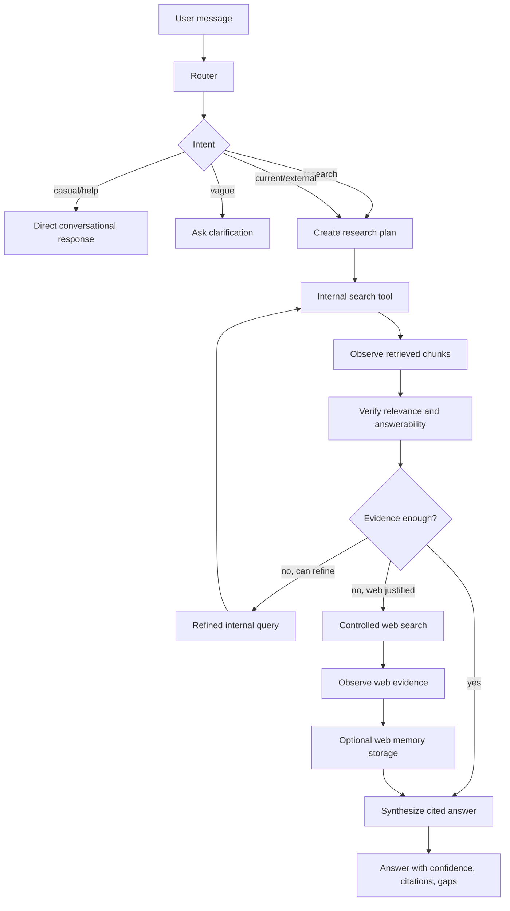
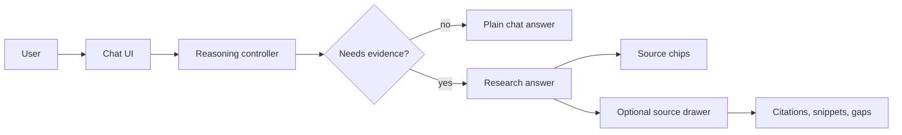
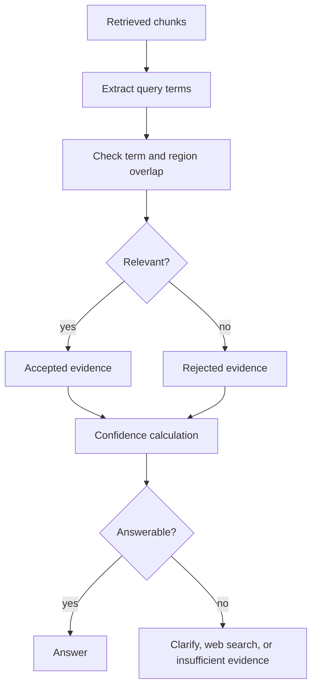
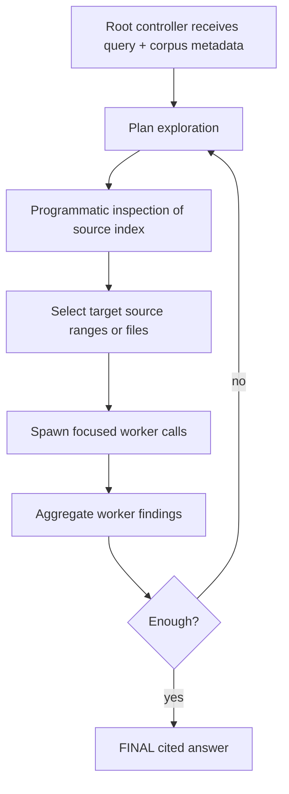

# Venture Metrics Research Architecture Report

> Working document for mentor/team review.  
> Current status: working local prototype, source-ingestion pipeline complete, RLM-style reasoning controller under active testing.  
> Last updated: 2026-05-26.

## 1. Executive Summary

Venture Metrics started as a Perplexity-style research assistant over Excel-derived sources. The first architecture was a conventional RAG pipeline:

```text
question -> retrieve internal chunks -> score evidence -> maybe web search -> generate cited answer
```

That worked for factual research questions, but it failed as a product brain. It treated many user messages as retrieval tasks, exposed implementation details in the UI, and did not have a strong "think before acting" layer. A greeting such as `hi` or `how are you?` should not trigger retrieval, citations, source panels, or fixed research-assistant boilerplate. This failure exposed the core issue: RAG was being used as the whole agent instead of as one possible tool.

The current direction is to move from a RAG-first chatbot to an RLM-inspired reasoning architecture:

```text
user message -> route intent -> plan -> choose tools -> observe -> verify -> answer
```

In this design, internal retrieval and web search are tools selected by a controller. They are not automatic first steps. This matches the practical lesson from the RLM research direction: the model/controller should interact with data as an environment and decide what to inspect, rather than blindly stuffing or retrieving context for every message.

## 2. Process Timeline

| Phase | What we built or learned | Resulting decision |
|---|---|---|
| Phase 0: Product goal | Build a lightweight Perplexity-style assistant for Venture Metrics sources. | Start with a practical evidence pipeline, not a polished product. |
| Phase 1: Source discovery | Profile unknown Excel files and extract URLs from arbitrary sheets. | Treat Excel as a source map, not the final knowledge base. |
| Phase 2: Evidence library | Fetch URL content, store markdown documents, chunk content, and index it. | Build reusable evidence memory before improving chat behavior. |
| Phase 3: Linear RAG | Retrieve chunks, score evidence, use web fallback, synthesize cited answer. | RAG proved grounding, but not thinking or action selection. |
| Phase 4: Failure analysis | Casual prompts and weak prompts exposed over-searching and fixed responses. | Add a routing layer before retrieval. |
| Phase 5: RLM-style controller | Implement route -> plan -> act -> observe -> verify -> answer. | Make retrieval and web search tools, not automatic behavior. |
| Phase 6: Product cleanup | Remove agent selectors, technical badges, toggles, and debug panels from the UI. | Present the system as an assistant, not an architecture demo. |
| Phase 7: Next research | Compare current controller with deeper RLM mechanisms. | Test whether recursive/programmatic exploration improves answerability. |

### Key Decision Log

| Decision | Chosen path | Reason |
|---|---|---|
| Knowledge base foundation | Build from Excel-linked public sources, not just spreadsheet cells. | The Excel files identify sources; the linked content contains the real evidence. |
| Storage | SQLite plus markdown documents for prototype. | Fast local iteration, easy lineage, no managed-service dependency. |
| Retrieval | SQLite FTS first, vector/reranker later. | Good enough for prototype and easier to inspect. |
| LLM provider | OpenAI-compatible adapter with DeepSeek default. | Keeps Qwen, Hunyuan, Kimi, GLM, ERNIE, or other compatible providers possible later. |
| Search provider | Tavily as development adapter only. | Useful now, but not a core dependency for mainland-compatible deployment. |
| Agent brain | Move from linear RAG to RLM-style reasoning controller. | The assistant needs intent routing, action selection, verification, and non-search conversation. |
| UI philosophy | Hide architecture internals from users. | The demo should show product behavior, not implementation switches. |

## 3. Research Motivation

The project is not only a chatbot prototype. It is a research experiment in how to build a better evidence assistant for venture/startup data.

The system needs to:

| Requirement | Why it matters |
|---|---|
| Answer normal conversation | A usable assistant must distinguish chat from research. |
| Use internal evidence first | The Excel files are the user's source map and should be respected. |
| Avoid hallucination | Venture/policy/startup claims need citations and confidence labels. |
| Use web only when justified | Web search should be a controlled action, not a default behavior. |
| Preserve source lineage | Every answer should trace back to source URLs, rows, chunks, or web results. |
| Support mainland China constraints | LLM, search, and extraction providers must be replaceable. |
| Support experimentation | We need to compare RAG, RLM-style control, and future deeper research agents. |

## 4. Starting Point: Source-Map RAG Prototype

The starting dataset was a Google Drive folder containing 9 Excel files. The Excel files were not treated as the final knowledge base. They were treated as a source map: rows contained URLs to articles, reports, policy pages, university pages, incubators, companies, and other public sources.

### Initial Pipeline



### Completed Data Pipeline

| Stage | Status | Artifact |
|---|---:|---|
| Excel profiling | Complete | `excel_profile_report.json`, `excel_profile_summary.json` |
| Raw row ingestion | Complete | `raw_rows` table |
| URL extraction | Complete | `sources` table |
| Source registry | Complete | `source_registry.csv` |
| Fetch/extraction | Complete | `venture_metrics_agent/data/documents/source_*.md` |
| Chunking/indexing | Complete | `chunks`, `chunks_fts` |
| Local UI | Working | `scripts/serve_agent.py` |
| Reasoning controller | Working prototype | `venture_metrics_agent/reasoning/` |

### Current Corpus Counts

| Metric | Count |
|---|---:|
| Excel files | 9 |
| Sheets | 25 |
| Raw rows | 661 |
| URL occurrences | 686 |
| Unique source records | 674 |
| Fetched sources | 600 |
| Failed sources | 74 |
| Stored documents | 600 |
| Indexed chunks | 3,559 |

## 5. Original RAG Architecture

The first agent was intentionally simple. It was meant to prove that we could ingest the files, extract sources, index evidence, and answer questions.



### What RAG Did Well

| Strength | Result |
|---|---|
| Fast prototype path | We got from Excel files to a working cited assistant quickly. |
| Source grounding | Answers could cite URLs from the indexed source registry. |
| Traceability | Sources, documents, chunks, and query logs were persisted. |
| Replaceable providers | LLM and web search were hidden behind adapters. |
| Internal-first behavior | The system preferred indexed sources before web search. |

### Where RAG Failed as the Product Brain

| Failure | Example | Root cause |
|---|---|---|
| No intent gate | `hi` could be treated as a research turn in earlier versions. | Retrieval was too close to the entry point. |
| Weak conversational behavior | Greetings received fixed research-assistant boilerplate. | The system had no separate casual-chat path. |
| Tool overuse | Web/internal source surfaces appeared for non-research turns. | Retrieval state was exposed as product state. |
| Debug UI leakage | Agent names, tool labels, and trace panels were visible. | Prototype internals leaked into the demo interface. |
| Limited thinking loop | One retrieve-score-answer pass could not recover from off-topic chunks. | No plan-act-observe-verify loop. |
| Poor answerability control | The system could produce "insufficient" after irrelevant retrieval without first reasoning about the request. | Evidence sufficiency was downstream, not upstream. |

The conclusion was not that retrieval is useless. The conclusion was that retrieval is not the agent. Retrieval should be a capability that a reasoning controller can decide to use.

## 6. Research Basis: Why Move Toward RLM

Three research/architecture articles shaped the current direction:

| Source | Relevant takeaway for this project |
|---|---|
| [Your RAG Pipeline Is Overkill / Recursive Language Models](https://www.decodingai.com/p/recursive-language-models) | RLMs treat data as an external environment and let the model/controller inspect, filter, decompose, and validate only what is needed. The article also warns that RLMs are better for deep thinking than low-latency chat, so the product must still keep casual turns lightweight. |
| [RAG Evaluation: The Only 6 Metrics You Need](https://www.decodingai.com/p/rag-evaluation-6-metrics-framework) | Evaluation should track the relationships between question, context, and answer. For this project, answerability, context support, faithfulness, and answer relevance are the critical checks. |
| [Production RAG from Scratch](https://www.decodingai.com/p/production-rag-from-scratch-senior-architect-guide) | Retrieval and generation must remain separate failure domains. Provider adapters, explicit orchestration, and source lineage make the system debuggable. |

### Interpretation for Venture Metrics

The RLM article does not mean "delete all retrieval infrastructure immediately." It means the system should not blindly rely on retrieval as the only reasoning mechanism. For our domain:

| Question | Decision |
|---|---|
| Do we still need source storage and indexing? | Yes. The indexed corpus is useful evidence memory. |
| Should RAG be the top-level agent? | No. It overuses retrieval and lacks intent control. |
| Should retrieval become a tool? | Yes. Internal search is useful when selected by the controller. |
| Should web search be automatic? | No. It should be triggered only by current/external/weak-evidence conditions. |
| Should the next experiment be closer to RLM? | Yes. The controller should plan, inspect, verify, and iterate. |

## 7. RAG vs RLM-style Architecture

| Dimension | Linear RAG | Current RLM-style Controller |
|---|---|---|
| Entry behavior | Assumes user asks a research question | Classifies intent first |
| Casual chat | Poor or fixed | Direct conversational response |
| Retrieval | Default action | Optional tool |
| Web search | Fallback after scoring | Gated by route and evidence verification |
| Reasoning | Mostly implicit in prompts | Explicit route-plan-act-observe-verify loop |
| Evidence validation | Scoring after retrieval | Verification before answer and before web escalation |
| UI | Exposed technical state early | Hides internals, shows sources only when useful |
| Debuggability | Query logs and chunks | Query logs plus structured reasoning trace |
| Research fit | Good baseline | Better architecture for testing thinking behavior |

## 8. Current RLM-style Architecture

The current implementation is an RLM-inspired controller, not yet a full academic RLM implementation. A full RLM would use a persistent REPL environment, recursive worker sub-calls, and programmatic data exploration over large external state. Our current version implements the first production-useful layer: a reasoning controller that decides whether to answer directly, search internally, use web, or refuse.

### Current Flow



### Product-facing Flow



## 9. Current Controller Components

| Module | Responsibility |
|---|---|
| `reasoning/router.py` | Classifies message intent before any tool call. Handles casual chat, system help, vague prompts, research prompts, current prompts, and web-explicit prompts. |
| `reasoning/casual.py` | Generates non-retrieval conversational responses for greetings, social turns, thanks, and help-style messages. |
| `reasoning/controller.py` | Orchestrates the full route -> plan -> act -> observe -> verify -> answer loop. |
| `reasoning/planner.py` | Builds bounded internal-search query variants for refinement. |
| `reasoning/tools.py` | Wraps internal corpus retrieval and web search as selectable tools. |
| `reasoning/verifier.py` | Rejects weak/off-topic evidence and decides whether more evidence is needed. |
| `reasoning/workspace.py` | Records structured reasoning trace for debugging and evaluation. |
| `reasoning/web_memory.py` | Stores useful web results into the source registry, document store, and index. |
| `reasoning/eval_runner.py` | Runs deterministic evaluation cases against a temporary DB copy. |

## 10. Routing Policy

The router is the most important product fix because it decides whether the assistant should act at all.

| User message type | Example | Route | Tool use |
|---|---|---|---|
| Greeting | `hi` | `casual_chat` | None |
| Social | `how are you?` | `casual_chat` | None |
| Capability question | `what can you do?` | `system_help` | None |
| Too vague | `research this` | `clarification_needed` | None |
| Internal research | `Which sources mention startup funding?` | `internal_research` | Internal search first |
| Current data | `latest Hong Kong startup grants` | `current_research` | Internal search plus controlled web |
| Explicit web | `look this up online` | `external_research` | Internal search plus controlled web |

### Why This Matters

The earlier system treated a chatbot like a search form. The current system treats the user message as an action-selection problem. This is the first step toward a stronger agent architecture.

## 11. Evidence Policy

The assistant should not answer important factual claims from memory. It should use evidence when evidence is required, and it should say when the evidence is weak.

### Evidence Scoring

| Signal | Effect |
|---|---|
| Government, university, science park source | Raises confidence |
| Company/investor official source | Raises confidence moderately |
| Multiple independent sources | Raises confidence |
| Unknown or weak source | Lowers confidence |
| Off-topic retrieval result | Rejected before synthesis |
| Current/latest question without web | Low confidence or web escalation |
| No accepted evidence | Insufficient evidence |

### Verification Flow



## 12. Web Search Policy

Web search is no longer a default behavior. It is a controlled tool.

| Trigger | Web allowed? | Reason |
|---|---:|---|
| Casual chat | No | No evidence needed. |
| Help question | No | System capability question. |
| Internal evidence is strong | No | Indexed corpus is enough. |
| Internal evidence is weak or missing | Yes | Need external support. |
| User asks for current/latest data | Yes | Internal corpus may be outdated. |
| User explicitly requests web/public verification | Yes | User intent requires it. |

If useful web results are found, they can be persisted as source memory:

```text
web result -> source registry -> document row -> markdown file -> chunks -> FTS index
```

This means the system can become better over time without relying on web search for the same topic repeatedly.

## 13. UI Evolution

The UI initially exposed too much prototype state. This made the product feel like a debugging panel instead of a research assistant.

### Removed from Product UI

| Removed item | Reason |
|---|---|
| Agent selector | The product should not ask users to choose internal architecture. |
| Web fallback toggle | Search policy should be controlled by the reasoning layer. |
| Remember web toggle | Storage policy is a system decision, not a chat input control. |
| Technical badges such as `agent` and `no_tools` | Internal trace terms should not appear in the demo. |
| Always-visible source inspector | Casual chat should not show source/debug panes. |
| Trace and rejected evidence sections | Useful for development, distracting for presentation. |

### Current Product Behavior

| Case | UI behavior |
|---|---|
| Casual answer | Plain assistant message only. |
| Research answer with citations | Confidence badge, source chips, optional source drawer. |
| Insufficient evidence | Clear gap/caveat shown without fake certainty. |
| Sidebar prompts | Presentation-ready demo prompts for indexed-source research. |

## 14. Evaluation Strategy

The evaluation direction follows the question-context-answer framing from the RAG evaluation article. For this project, the critical checks are:

| Metric | Local interpretation |
|---|---|
| Context relevance | Did retrieved chunks match the question? |
| Faithfulness | Did the answer stay inside the cited evidence? |
| Answer relevance | Did the response actually answer the user? |
| Context support | Was there enough evidence to support the answer? |
| Question answerability | Should the assistant answer, search, clarify, or refuse? |
| Self-containment | Can the answer be understood without seeing the original prompt? |

### Current Automated Eval Cases

| Case | Expected behavior |
|---|---|
| `hi` | Casual response, no tools, no citations. |
| `What can you do?` | System help, no tools, no citations. |
| `Which sources are related to Hong Kong entrepreneurship support?` | Internal research, citations required. |
| `What are the latest Hong Kong startup grants?` | Current research, controlled web allowed. |
| `research this` | Clarification, no tools. |

Current local test result:

```text
23 passed
```

## 15. Why Not Stay With Pure RAG?

Pure RAG is good when the user always asks evidence questions. Our product is a chat assistant, not a search endpoint. It must decide whether the next action is conversation, clarification, internal research, web verification, or refusal.

| Problem with pure RAG | Why RLM-style control is better |
|---|---|
| Retrieval happens too early | Controller routes first, searches later. |
| Every message becomes a search problem | Casual chat is handled directly. |
| Wrong chunks can drive wrong answers | Verifier rejects weak/off-topic evidence. |
| Web search can be overused | Web is gated by route and evidence state. |
| Prompt-only reasoning is hard to inspect | Controller emits structured trace for development. |
| Hard to test action selection | Eval cases can assert route, source mode, and tool decisions. |

## 16. Why Not Full RLM Immediately?

A full RLM architecture is more complex than the current prototype needs. It would require a persistent execution environment, recursive worker calls, stricter sandboxing, cost controls, and more involved evaluation.

| Full RLM capability | Current status |
|---|---|
| Persistent REPL state | Not implemented yet. Current state is `ResearchWorkspace` and DB/filesystem persistence. |
| Recursive worker sub-calls | Not implemented yet. Current version uses bounded internal query refinement. |
| Programmatic corpus exploration | Partial. Retrieval/search tools are explicit, but the controller does not yet write code to inspect arbitrary files. |
| `FINAL(answer)` style stopping | Partial. The controller stops after bounded iterations and synthesis. |
| Guardrails such as max depth/output | Partial. Current guardrails include top-k, max web results, and max internal iterations. |

The current controller is the correct bridge step. It fixes the main product failures while keeping the system testable.

## 17. Current Architecture Map

```text
venture_metrics_agent/
  ingestion/
    excel_profiler.py
    excel_ingest.py
    url_extractor.py
    source_registry.py
    fetcher.py

  retrieval/
    retriever.py
    evidence_scorer.py
    web_search.py
    agent.py
    chunker.py

  reasoning/
    router.py
    casual.py
    planner.py
    tools.py
    verifier.py
    workspace.py
    web_memory.py
    eval_runner.py
    controller.py

  llm/
    provider.py
    prompts.py

  ui/
    local_server.py
```

## 18. Current Demo Flow

Recommended mentor/team demo:

1. Ask `hi`.
   - Expected: natural casual answer, no sources, no search.
2. Ask `how are you?`.
   - Expected: natural social answer, no sources, no search.
3. Click `Source library overview`.
   - Expected: internal indexed answer with citations.
4. Click `Official startup support`.
   - Expected: official/university/science park style source filtering.
5. Click `Funding and incubation evidence`.
   - Expected: evidence-backed synthesis with gaps.
6. Ask a latest/current question.
   - Expected: controlled web search only when justified.

## 19. Risk Register

| Risk | Current mitigation | Next mitigation |
|---|---|---|
| Web provider dependency | `web_search.py` adapter boundary | Add Bing/Baidu/360 compatible adapter |
| LLM provider dependency | OpenAI-compatible `LLMProvider` with DeepSeek default | Test Qwen/Hunyuan/Kimi-compatible endpoints |
| Off-topic retrieval | `verifier.py` rejects weak chunks | Add stronger reranking or semantic embeddings |
| Weak casual experience | `casual.py` route | Use configured LLM for richer casual turns with safe fallback |
| Evaluation too small | Fixed tests and eval cases | Add synthetic answerability and faithfulness sets |
| Not true RLM yet | Honest architecture boundary | Build REPL/worker experiment behind feature flag |
| UI still prototype-level | Simplified local SPA | Move to proper frontend when backend behavior stabilizes |

## 20. Next Research Steps

### Step 1: Strengthen RLM-style Controller

- Add more route categories: compare, summarize, list, source-audit, gap-analysis.
- Add route confidence and fallback to clarification when uncertain.
- Keep casual chat lightweight and source-free.

### Step 2: Improve Evidence Quality

- Add reranking or embedding search on top of FTS.
- Add source-type filters to retrieval.
- Add stricter official-source preference for policy/funding questions.

### Step 3: Build Better Evals

- Add 30-50 test prompts from the actual indexed source library.
- Include negative/unanswerable prompts.
- Score context relevance, context support, answer relevance, and answerability.
- Track tool-selection correctness separately from answer quality.

### Step 4: Experiment With True RLM

Prototype a contained RLM experiment:



Minimum viable RLM experiment:

| Component | MVP version |
|---|---|
| External environment | SQLite DB plus document markdown directory |
| Root state | Research workspace JSON |
| Programmatic access | Read-only helper functions over sources/documents/chunks |
| Workers | Focused LLM calls over selected snippets/files |
| Guardrails | Max iterations, max workers, max source text, read-only access |
| Output | JSON answer with citations and trace |

### Step 5: Productize Only After Behavior Stabilizes

- Keep backend provider adapters.
- Keep UI free of architecture jargon.
- Expose citations and gaps, not internal traces.
- Build deployment plan only after we validate the reasoning path.

## 21. Current Research Conclusion

The project began as a RAG prototype because RAG was the fastest way to prove source ingestion, evidence indexing, and cited answers. That phase succeeded.

The project is now moving toward an RLM-style architecture because the product needs more than retrieval. It needs action selection, reasoning, verification, and the ability to decide not to search. The core insight is:

```text
RAG is useful evidence infrastructure.
RLM-style control is the candidate product brain.
```

The current system should therefore be evaluated as a reasoning-first assistant with retrieval and web search as tools. The next research question is whether deeper RLM mechanisms, especially programmatic corpus exploration and recursive worker calls, improve accuracy and answerability enough to justify their complexity.

## References

1. Paul Iusztin, [Your RAG Pipeline Is Overkill / Recursive Language Models](https://www.decodingai.com/p/recursive-language-models), Decoding AI, 2026-04-07.
2. Paul Iusztin, [RAG Evaluation: The Only 6 Metrics You Need](https://www.decodingai.com/p/rag-evaluation-6-metrics-framework), Decoding AI.
3. Priya, [Production RAG: Learning from Scratch Done Right](https://www.decodingai.com/p/production-rag-from-scratch-senior-architect-guide), Decoding AI.
